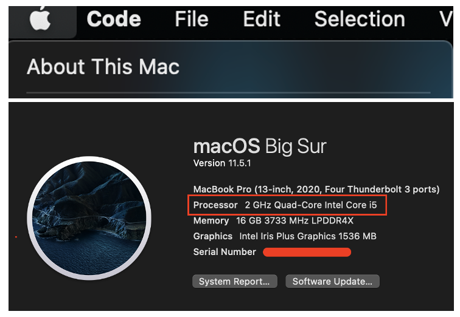
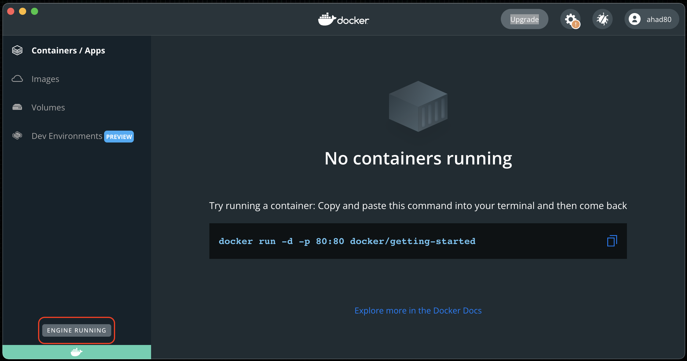
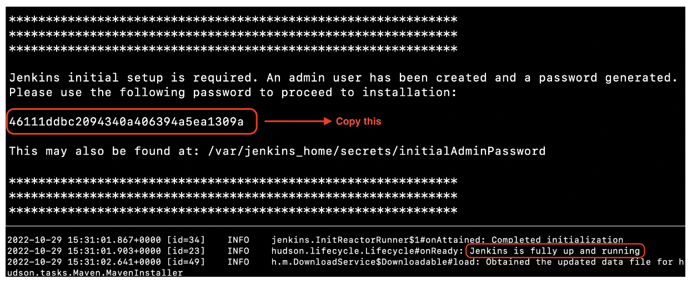
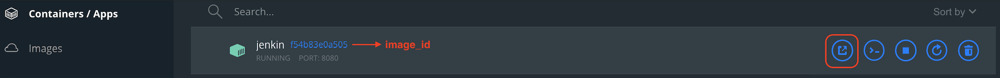
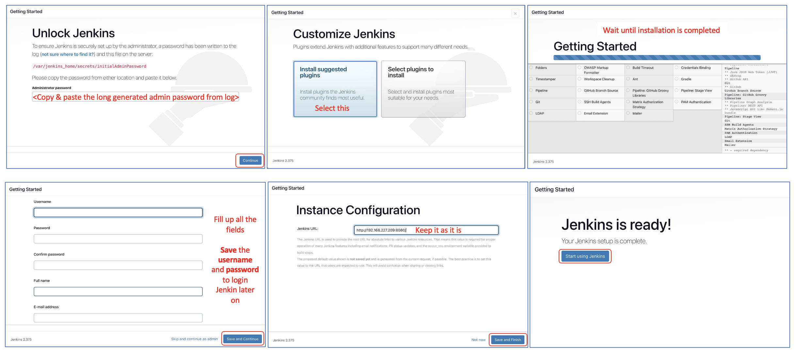
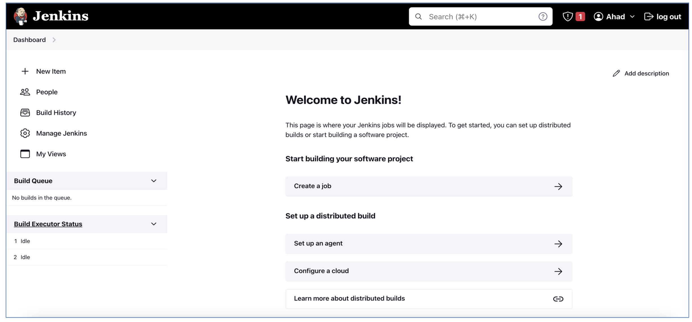

# Install Docker Desktop and run a Jenkin container on Mac
## Description
Here I am creating a custom Jenkin docker image which has **Python3, Pip3, Gcloud CLI, AWS CLI** installed.

## Prerequisite
***Based on Docker Desktop version the UI may change.***
* [Install Docker Desktop](https://github.com/ShaktiAhad/jenkin-doc/edit/main/README.md#install-docker-desktop)
* [Start Docker Desktop](https://github.com/ShaktiAhad/jenkin-doc/edit/main/README.md#start-docker-desktop)

  ## Install Docker Desktop
    * Download the right docker desktop app from this url: [Docker Desktop](https://docs.docker.com/desktop/install/mac-install/). 
      - *To confirm which one you should download Go to **preference**, click **About This Mac** and check **Processor**. If you see **intel** then download the **Mac with Intel chip** else download the other one.*
    

        
    

  ## Start Docker Desktop
    * Click on **Launchpad**, search for **docker** and click the dokcer icon. Wait for few seconds until the docker engine starts when it is completely started the left bottom part will be **green** and if you hover the mosue pointer on it; **ENGINE RUNNING** message will appear.

    

        
    

## Start Jenkin container and access from browser

**First create a directory where jenkin's home folder will be mounted.**
- `mkdir ~/jenkin_home` ***this way even if we stop or terminate the container our pipeline will be saved.***

**Build jenkin image**
- Execute: `docker build --progress=plain --no-cache -t jenkin --build-arg PROCESSOR="$(sysctl -n machdep.cpu.brand_string)" .`
- Wait until the build is completed. This will create an image, name: **jenkin** & can be confirmed from docker desktop by clicking **Images** from left panel. 

**Start jenkin container**
- Execute: `docker run --name jenkin -v ~/jenkin_home:/var/jenkins_home -p $(ipconfig getifaddr en0):8080:8080 <image_id>`

- This will start a jenkin docker container and will expose on port 8080 and can be confirmed from docker desktop by clicking **Container/Apps** from left panel. 

**Check the container logs**
- Initially to login Jenkin UI we need an admin password which is generated automatically when the container starts loading. Copy that admin password. 
- When the container is fully up and running you will see this log **Jenkins is fully up and running.**

    

**Access Jenkin from browser**
- Go to Docker Desktop select **Container/Apps** and hover the pointer over the container name: **jenkin** & click the blue arrow button.  

    

**Jenkin UI setup completion**

    

    

